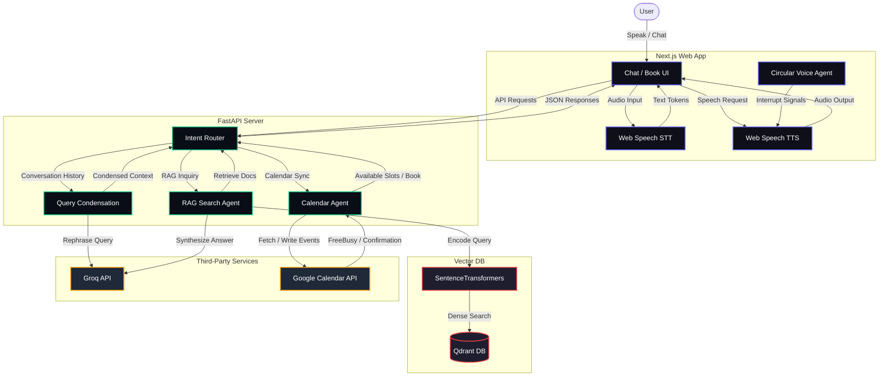

# AI Candidate Representative & Booking Agent

A premium, interactive AI representative and scheduling assistant designed for Mohammed Shaaz's professional portfolio. Built on a hybrid architecture combining a FastAPI RAG backend querying a local Qdrant Vector database and a Next.js frontend with browser-native Web Speech APIs.

---

## 🛠 Tech Stack

*   **Frontend**: Next.js 16 (React 19) + Vanilla CSS + Tailwind CSS v4
*   **Backend**: FastAPI (Python 3.11+) + Uvicorn
*   **Vector Database**: Qdrant (semantic storage for resumes and repository files)
*   **LLM & Embedding**: Groq (`llama-3.3-70b-versatile`) + Local `sentence-transformers`
*   **Voice APIs**: Browser Web Speech API (SpeechRecognition & SpeechSynthesis)
*   **Integrations**: Google Calendar API (OAuth 2.0 + FreeBusy availability check)

---

## 📐 System Architecture



---

## ⚡ Setup & Installation

### 1. Prerequisites
*   Node.js (v18+)
*   Python (v3.10+)
*   Docker (for running Qdrant)

### 2. Database Setup (Qdrant)
Start Qdrant using Docker:
```bash
docker run -p 6333:6333 -p 6334:6334 -v qdrant_storage:/qdrant/storage qdrant/qdrant
```

### 3. Backend Setup
1.  Navigate to the backend directory:
    ```bash
    cd backend
    ```
2.  Install dependencies:
    ```bash
    pip install -r requirements.txt
    ```
3.  Create a `.env` file containing your credentials:
    ```env
    GROQ_API_KEY=your_groq_api_key_here
    QDRANT_URL=http://localhost:6333
    ```
4.  Launch the FastAPI server:
    ```bash
    python main.py
    ```

### 4. Google Calendar API Integration
To connect your live Google Calendar:
1.  Go to the [Google Cloud Console](https://console.cloud.google.com/).
2.  Enable the **Google Calendar API** and create a **Desktop Application** OAuth credential.
3.  Download the client configuration JSON file, rename it to exactly `credentials.json`, and place it in the `backend/` root directory.
4.  Install the required Google client libraries:
    ```bash
    pip install google-api-python-client google-auth-httplib2 google-auth-oauthlib
    ```
5.  On your first scheduling request, a browser window will open to prompt a one-time Google Account login. This generates a secure `token.json` file for silent calendar access in the future.

### 5. Frontend Setup
1.  Navigate to the frontend directory:
    ```bash
    cd ../frontend
    ```
2.  Install dependencies:
    ```bash
    npm install
    ```
3.  Start the Next.js dev server:
    ```bash
    npm run dev
    ```
4.  Open `http://localhost:3000` in Google Chrome or Edge.

---

## 💰 Cost Breakdown (Per Query / Per Session)

Because the heavy operations (transcription, speech synthesis, and vector database embeddings) run entirely **locally and client-side**, the operating cost is virtually **free**, with the exception of the Groq LLM API.

### Cost Parameters:
*   **LLM**: Groq Llama-3.3-70B-Versatile ($0.59 / M input tokens, $0.79 / M output tokens).
*   **Input size**: ~1,500 tokens (System Prompt + RAG context + 3 history turns).
*   **Output size**: ~100 tokens (short, concise responses).

### Calculation per Turn:
$$\text{Input Cost} = 1,500 \times \frac{\$0.59}{1,000,000} = \$0.000885$$
$$\text{Output Cost} = 100 \times \frac{\$0.79}{1,000,000} = \$0.000079$$
$$\text{Total per turn} \approx \mathbf{\$0.00096} \text{ (under 1/10th of a cent)}$$

### Total Conversation Cost:
*   **1 Turn**: **$0.00096**
*   **1 Chat Session (10 Turns)**: **$0.0096** (less than **1 cent** total)
*   **Vector Search & Embeddings**: **$0.00** (Local Qdrant CPU instance)
*   **Speech Synthesis & Transcription**: **$0.00** (Native Web Speech API)

---

### 📞 Telephony vs. Web-Native Tradeoff (Why no real phone calling?)

During the design phase, we consciously avoided integrating real-time telephone API platforms (such as **Twilio**, **Vapi**, or **Retell AI**). While a telephony-based voice agent is a viable alternative, it introduces significant barriers for a developer portfolio:

1. **Telephony Carrier Costs**: Twilio phone numbers and inbound/outbound call routing incur active carrier rates of **~$0.013 to $0.02 per minute**.
2. **Orchestration Fees**: Low-latency voice pipelines (e.g. Vapi, Retell AI, or Bland AI) charge **~$0.05 to $0.15 per minute** to bind the Speech-to-Text, LLM, and Text-to-Speech endpoints together.
3. **Proprietary TTS/STT APIs**: High-quality cloud transcription and synthesis (Deepgram + ElevenLabs) charge an additional **~$0.02 to $0.04 per minute**.

Combined, a standard telephone call with an AI representative costs between **$0.10 and $0.20 per minute**, requiring active billing accounts and prepayments. 

By utilizing **browser-native Web Speech APIs (STT & TTS)**, we run the entire voice transcription and audio synthesis flow directly on the client's device for **$0.00**. This makes the portfolio 100% free to host, zero-maintenance, and completely safe from billing exploits, while maintaining the same conversational capabilities.